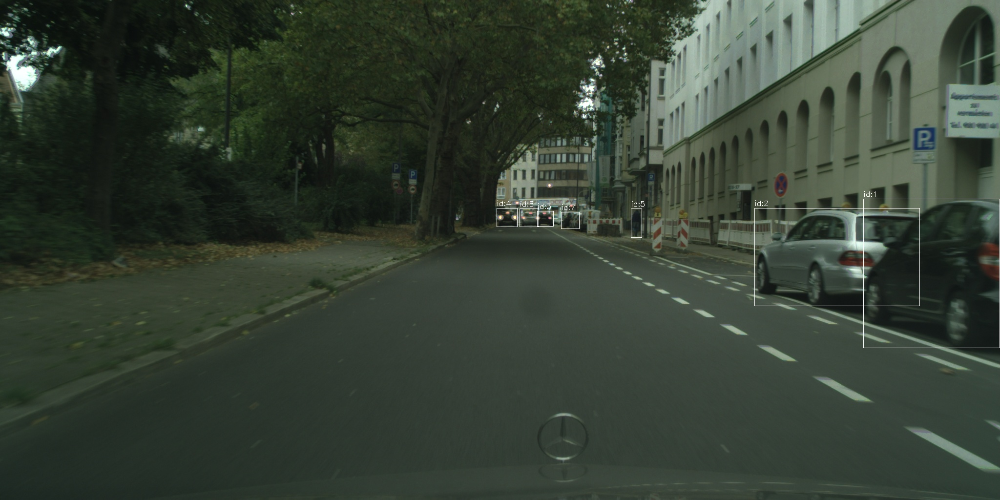

# Cityscapes-100 Importance Annotation Dataset

## Overview
This dataset is a curated subset of the **Cityscapes** dataset, focusing on object detection and importance annotation for urban driving scenarios.  
We select **100 images** from **17 different cities** and process them through a **two-stage annotation pipeline**:

1. **Object Detection** – Using YOLO to detect components such as cars, pedestrians, and other road entities.
2. **Importance Annotation** – Assigning importance levels to detected objects via:
   - **Automated annotation** using GPT-4o-preview
   - **Human evaluation** from three annotators

---

## Dataset Structure

```
.
├── allocated_feifan/           # Human importance annotations by annotator Feifan
├── allocated_xiaoyan/          # Human importance annotations by annotator Xiaoyan
├── allocated_yifan/            # Human importance annotations by annotator Yifan
├── cityscapes-100/             # Original selected images
├── cityscapes-100-detected/    # YOLO detection results (JSON + visualization images)
├── cityscapes-100-allocated/   # Importance annotations (JSON) generated by ChatGPT
```

---

## Data Format

### 1. Detection Files (`*_detected.json`)
Each JSON file contains a list of detected objects as the example below:

```json
[
  {
    "name": "car",
    "class": 2,
    "confidence": 0.93183,
    "box": {
      "x1": 1768.89502,
      "y1": 407.99072,
      "x2": 2047.18567,
      "y2": 712.81262
    },
    "track_id": 1
  },
    ...
  {
    "name": "person",
    "class": 0,
    "confidence": 0.59784,
    "box": {
      "x1": 1292.60205,
      "y1": 427.91779,
      "x2": 1314.51208,
      "y2": 486.8418
    },
    "track_id": 5
  }
]
```

- **`name`**: Detected object label  
- **`class`**: Class index from YOLO model  
- **`confidence`**: Detection confidence score  
- **`box`**: Bounding box coordinates (top-left and bottom-right)  
- **`track_id`**: Unique ID for the detected object in the image  

---

### 2. Importance Annotation Files (`*_importance.json`)
Each JSON file is a mapping from `track_id` to an **importance score**:

```json
{
    "1": 2,
    "2": 2,
    "3": 1,
    "4": 1,
    "5": 0,
    "6": 1,
    "7": 0
}
```

- **0** → Low importance  
- **1** → Medium importance  
- **2** → High importance  

---

## Example
**Detected file:** `aachen_000002_000019_leftImg8bit_detected.json`  
**Importance file:** `aachen_000002_000019_leftImg8bit_importance.json`  
**Visualization:**  


---

## License
The original Cityscapes dataset is distributed under its own license. This subset follows the same licensing terms for images, with added annotations released under **CC BY 4.0**.
